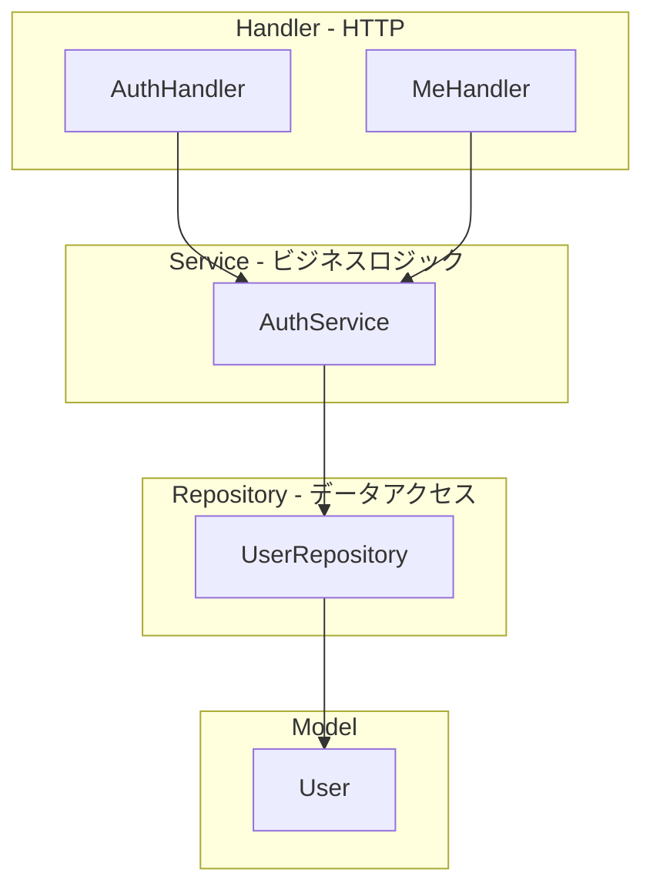

# Phase 2 実装プラン: 認証・ユーザー

## 開発方針

- **MVC パターン**: Model / Service(Controller) / Handler(View の入出力)
- **DI**: インターフェース経由で依存を注入
- **TDD**: レッド → グリーン（テスト先行）

## アーキテクチャ



## ディレクトリ構成（Phase 2 追加分）

```
backend/
├── internal/
│   ├── model/
│   │   └── user.go           # User エンティティ
│   ├── repository/
│   │   ├── user_repository.go # インターフェース
│   │   └── pg_user_repository.go # PostgreSQL 実装
│   ├── service/
│   │   ├── auth_service.go    # インターフェース
│   │   └── auth_service_impl.go # 実装
│   └── handler/
│       ├── auth_handler.go    # OAuth, ログイン/ログアウト
│       └── me_handler.go      # GET /api/me
├── pkg/
│   └── auth/
│       └── middleware.go      # 認証ミドルウェア
└── test/
    └── integration/          # 統合テスト（任意）
```

## 認証プロバイダ汎用化仕様

複数プロバイダ（Google / GitHub / Apple / Email）を**一つの入口**で扱い、同一ユーザー判定（email でリンク）を共通ロジックにまとめる。

### プロバイダの定義

| 定数 | 説明 | users カラム |
|------|------|--------------|
| `google` | Google OAuth | google_id |
| `github` | GitHub OAuth | github_id |
| `apple` | Apple Sign In | apple_id |
| `email` | Email（まずマジックリンク。パスワードは将来拡張） | email。マジックリンク時は providerUserID に検証トークン ID を渡す。password_hash は将来用。 |

- 実装では `Provider` 型（string または iota）で上記を列挙。追加プロバイダはここに列を足す。
- **Email UI 方針**: マジックリンク方式を採用（`docs/mock-implementation-status.md` 3.7・12.1 参照）。「Email」クリック → メール入力フォーム → 送信 → メール内リンクで検証 API → セッション確立。パスワード方式は将来検討。

### 有効プロバイダの切り替え

- **環境変数の有無で有効化**する。クライアント ID 等が設定されているプロバイダのみ利用可能。
- 例: `GOOGLE_CLIENT_ID` が空でなければ Google を有効、`GITHUB_CLIENT_ID` が空でなければ GitHub を有効。フロントは `GET /api/auth/providers`（任意）で有効なプロバイダ一覧を取得し、該当するログインボタンのみ表示するか、または従来どおり全ボタンを出し、無効なプロバイダは 404 や設定エラーで弾く。
- 自ホストでは必要なプロバイダの環境変数だけ設定すればよい。

### ログイン時の共通フロー（GetOrCreateUserFromProvider）

1. **プロバイダ ID で検索**（例: FindByProviderID("google", sub)）→ 見つかればそのユーザーを返して終了。
2. 見つからなければ **email で検索**（FindByEmail）。OAuth の場合はプロバイダから取得した email を使用。Email プロバイダの場合は入力された email。
3. **email で既存ユーザーが見つかった場合**: そのユーザーの当該プロバイダ用カラム（google_id / github_id / apple_id）を更新（Update）し、同一アカウントにリンク。更新後のユーザーを返す。
4. **見つからなかった場合**: 新規ユーザーを Create し、返す。

※ Email プロバイダはまずマジックリンクのみ。検証トークンで一意 ID を発行し、GetOrCreateUserFromProvider("email", tokenId, email, "") でユーザー取得・作成。パスワード方式を将来追加する場合は、新規時に password_hash を保存し、既存 email の場合はパスワード照合でログイン。

---

## インターフェース設計

### UserRepository（汎用化後）

```go
type UserRepository interface {
    FindByID(ctx context.Context, id string) (*model.User, error)
    FindByProviderID(ctx context.Context, provider string, providerUserID string) (*model.User, error)
    FindByEmail(ctx context.Context, email string) (*model.User, error)
    Create(ctx context.Context, user *model.User) error
    Update(ctx context.Context, user *model.User) error
}
```

- `FindByProviderID`: provider に "google" / "github" / "apple" を渡し、対応する *_id カラムで検索。
- `FindByEmail`: 同一ユーザー判定（リンク）用。email は正規化（小文字・trim）してから検索する方針を推奨。

### AuthService（汎用化後）

```go
type AuthService interface {
    GetOrCreateUserFromProvider(ctx context.Context, provider string, providerUserID string, email string, name string) (*model.User, error)
    GetUserFromSession(ctx context.Context, sessionID string) (*model.User, error)
}
```

- 各 OAuth コールバック（Google / GitHub / Apple）は、プロバイダから取得した `sub`（または id）, `email`, `name` を渡して `GetOrCreateUserFromProvider` を 1 回呼ぶ。
- Email ログイン（マジックリンク検証後 or パスワード照合後）も、provider `"email"`, providerUserID は email または検証済みトークンの一意 ID、email, name を渡して同じメソッドを呼ぶ。パスワードの照合・ハッシュ保存は AuthService 内または別レイヤーで実施。

### 後方互換（移行時）

- 既存の `FindByGoogleID` がいる場合は、内部で `FindByProviderID(ctx, "google", googleID)` を呼ぶラッパーに差し替え、または段階的に呼び出し元を `FindByProviderID` に変更してから `FindByGoogleID` を削除する。

---

## API 設計

| メソッド | パス | 説明 |
|----------|------|------|
| GET | /api/auth/google/login | Google OAuth 開始（リダイレクト URL を返す） |
| GET | /api/auth/google/callback | OAuth コールバック、セッション確立 |
| GET | /api/auth/github/login | GitHub OAuth 開始（拡張時） |
| GET | /api/auth/github/callback | GitHub コールバック（拡張時） |
| GET | /api/auth/apple/login | Apple Sign In 開始（拡張時） |
| GET | /api/auth/apple/callback | Apple コールバック（拡張時） |
| POST | /api/auth/logout | ログアウト |
| GET | /api/me | 現在のユーザー情報（認証必須） |
| GET | /api/auth/providers | （任意）有効プロバイダ一覧。フロントが表示するログインボタンを決める用。 |

## データモデル

### users テーブル

| カラム | 型 | 説明 |
|--------|-----|------|
| id | UUID | PK |
| email | VARCHAR | メールアドレス（同一ユーザー判定のキー。idea.md の「email で 1 アカウントにまとめる」方針に使用） |
| name | VARCHAR | 表示名 |
| google_id | VARCHAR | Google の sub（NULL 可。複数プロバイダ対応時は他も追加） |
| github_id | VARCHAR | GitHub の id（NULL 可。拡張時追加） |
| apple_id | VARCHAR | Apple の sub（NULL 可。拡張時追加） |
| password_hash | VARCHAR | Email パスワード認証用ハッシュ（NULL 可。Email ログイン導入時のみ） |
| created_at | TIMESTAMP | |
| updated_at | TIMESTAMP | |

※ ログイン時はプロバイダ ID で検索。既存ユーザーがいなければ新規作成。**同じ email の既存ユーザーがいれば、その行に当該プロバイダの *_id を追加してリンク**（idea.md 同一ユーザー判定に準拠）。email は OAuth から取得できる場合は必ず保存し、検索用に UNIQUE インデックスを検討する。

### donor_tokens テーブル（匿名寄付者トラッキング）

| カラム | 型 | 説明 |
|--------|-----|------|
| token | VARCHAR | PK、UUID |
| created_at | TIMESTAMP | |

※ Phase 2 では users を優先。donor_tokens は Phase 4 寄付フローで活用。

## TDD 実装順序

### 1. 基盤リファクタ（既存を DI 化）

1. **Red**: `UserRepository` インターフェースを定義、`Handler` が `*repository.Repository` に直接依存している現状をインターフェース依存に変更するテストを書く
2. **Green**: リファクタ完了

### 2. User モデル・マイグレーション

1. **Red**: `users` テーブルが存在することを確認するテスト
2. **Green**: マイグレーション実行

### 3. UserRepository

1. **Red**: `FindByProviderID(ctx, "google", id)` がユーザーを返すテスト
2. **Green**: `PgUserRepository` 実装（FindByProviderID は google_id / github_id / apple_id を provider で振り分けて検索）
3. **Red**: `FindByEmail` がユーザーを返すテスト
4. **Green**: FindByEmail 実装

### 4. AuthService

1. **Red**: `GetOrCreateUserFromProvider(ctx, "google", sub, email, name)` が新規ユーザーを作成するテスト
2. **Green**: AuthService 実装（プロバイダ ID 検索 → email 検索 → リンク or 新規作成）
3. **Red**: 同じ email で別プロバイダ呼び出し時に既存ユーザーにリンクするテスト
4. **Green**: リンク処理の実装

### 5. AuthHandler（OAuth フロー）

1. **Red**: `/api/auth/google/login` がリダイレクト URL を返すテスト
2. **Green**: Handler 実装（Google 用設定が有効な場合のみ）
3. **Red**: `/api/auth/google/callback` が `GetOrCreateUserFromProvider("google", ...)` を呼びセッションを確立するテスト
4. **Green**: コールバック実装

### 6. GET /api/me

1. **Red**: 認証済みで `/api/me` がユーザー情報を返すテスト
2. **Green**: MeHandler 実装

### 7. フロントエンド

1. ログイン/ログアウト UI（React Island）
2. `/api/me` を呼んでログイン状態を表示

## 依存関係（DI グラフ）

```
main
  ├─ UserRepository (interface) ← PgUserRepository
  ├─ AuthService (interface) ← AuthServiceImpl(UserRepository)
  ├─ AuthHandler(AuthService, config)
  ├─ MeHandler(AuthService, SessionStore)
  └─ HealthHandler(HealthRepository)
```

## セッション管理

**方式: DB sessions テーブル**（implementation-plan.md と統一）

| 項目 | 内容 |
|------|------|
| **テーブル** | `sessions`: `id（UUID PK）, user_id（FK → users）, expires_at, created_at` |
| **Cookie** | `session_id=<UUID>`（HttpOnly, Secure（本番）, SameSite=Lax）。有効期限 30 日程度。 |
| **ログアウト** | `DELETE FROM sessions WHERE id = ?` で確実に無効化。 |
| **有効期限** | `expires_at` を毎リクエストで検証。期限切れは 401。 |

## 実装済み（Phase 2 完了）

- User モデル、users テーブル、マイグレーション
- UserRepository インターフェース（汎用化: FindByProviderID, FindByEmail）、PgUserRepository 実装
- AuthService インターフェース（GetOrCreateUserFromProvider）、AuthServiceImpl
- AuthHandler: Google OAuth ログイン/コールバック/ログアウト（他プロバイダは拡張で同様に追加）
- MeHandler: GET /api/me
- セッション管理: **DB sessions テーブル方式**（`sessions` テーブル + UUID Cookie）
- フロント: AuthStatus（ログイン/ログアウト UI）、/me ページ

## 手動動作確認（Phase 2）

[implementation-plan.md](implementation-plan.md) の「手動動作確認チェックリスト」Phase 2 を参照。

## 次のステップ

1. Google Cloud Console で OAuth クライアントを作成し、GOOGLE_CLIENT_ID / GOOGLE_CLIENT_SECRET を設定
2. Phase 3（プロジェクト CRUD）へ
