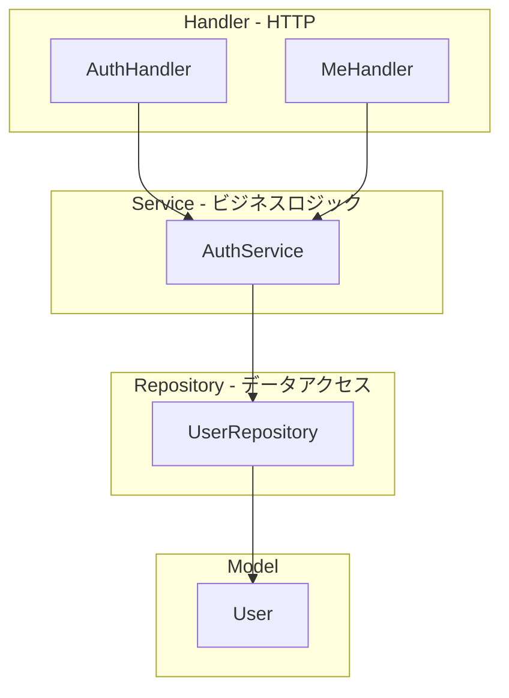

# Phase 2 実装プラン: 認証・ユーザー

## 開発方針

- **MVC パターン**: Model / Service(Controller) / Handler(View の入出力)
- **DI**: インターフェース経由で依存を注入
- **TDD**: レッド → グリーン（テスト先行）

## アーキテクチャ



## ディレクトリ構成（Phase 2 追加分）

```
backend/
├── internal/
│   ├── model/
│   │   └── user.go           # User エンティティ
│   ├── repository/
│   │   ├── user_repository.go # インターフェース
│   │   └── pg_user_repository.go # PostgreSQL 実装
│   ├── service/
│   │   ├── auth_service.go    # インターフェース
│   │   └── auth_service_impl.go # 実装
│   └── handler/
│       ├── auth_handler.go    # OAuth, ログイン/ログアウト
│       └── me_handler.go      # GET /api/me
├── pkg/
│   └── auth/
│       └── middleware.go      # 認証ミドルウェア
└── test/
    └── integration/          # 統合テスト（任意）
```

## インターフェース設計

### UserRepository

```go
type UserRepository interface {
    FindByID(ctx context.Context, id string) (*model.User, error)
    FindByGoogleID(ctx context.Context, googleID string) (*model.User, error)
    Create(ctx context.Context, user *model.User) error
    Update(ctx context.Context, user *model.User) error
}
```

### AuthService

```go
type AuthService interface {
    GetOrCreateUserFromGoogle(ctx context.Context, googleUser *GoogleUserInfo) (*model.User, error)
    GetUserFromSession(ctx context.Context, sessionID string) (*model.User, error)
}
```

## API 設計

| メソッド | パス | 説明 |
|----------|------|------|
| GET | /api/auth/google/login | Google OAuth 開始（リダイレクト URL を返す） |
| GET | /api/auth/google/callback | OAuth コールバック、セッション確立 |
| POST | /api/auth/logout | ログアウト |
| GET | /api/me | 現在のユーザー情報（認証必須） |

## データモデル

### users テーブル

| カラム | 型 | 説明 |
|--------|-----|------|
| id | UUID | PK |
| email | VARCHAR | メールアドレス |
| google_id | VARCHAR | Google の sub |
| name | VARCHAR | 表示名 |
| created_at | TIMESTAMP | |
| updated_at | TIMESTAMP | |

### donor_tokens テーブル（匿名寄付者トラッキング）

| カラム | 型 | 説明 |
|--------|-----|------|
| token | VARCHAR | PK、UUID |
| created_at | TIMESTAMP | |

※ Phase 2 では users を優先。donor_tokens は Phase 4 寄付フローで活用。

## TDD 実装順序

### 1. 基盤リファクタ（既存を DI 化）

1. **Red**: `UserRepository` インターフェースを定義、`Handler` が `*repository.Repository` に直接依存している現状をインターフェース依存に変更するテストを書く
2. **Green**: リファクタ完了

### 2. User モデル・マイグレーション

1. **Red**: `users` テーブルが存在することを確認するテスト
2. **Green**: マイグレーション実行

### 3. UserRepository

1. **Red**: `FindByGoogleID` がユーザーを返すテスト
2. **Green**: `PgUserRepository` 実装

### 4. AuthService

1. **Red**: `GetOrCreateUserFromGoogle` が新規ユーザーを作成するテスト
2. **Green**: `AuthService` 実装

### 5. AuthHandler（OAuth フロー）

1. **Red**: `/api/auth/google/login` がリダイレクト URL を返すテスト
2. **Green**: Handler 実装
3. **Red**: `/api/auth/google/callback` がセッションを確立するテスト
4. **Green**: コールバック実装

### 6. GET /api/me

1. **Red**: 認証済みで `/api/me` がユーザー情報を返すテスト
2. **Green**: MeHandler 実装

### 7. フロントエンド

1. ログイン/ログアウト UI（React Island）
2. `/api/me` を呼んでログイン状態を表示

## 依存関係（DI グラフ）

```
main
  ├─ UserRepository (interface) ← PgUserRepository
  ├─ AuthService (interface) ← AuthServiceImpl(UserRepository)
  ├─ AuthHandler(AuthService, config)
  ├─ MeHandler(AuthService, SessionStore)
  └─ HealthHandler(HealthRepository)
```

## セッション管理

- **Cookie**: HttpOnly, Secure（本番）, SameSite=Lax
- **セッション ID**: ランダム文字列、サーバー側で Redis または DB に保存
- Phase 2 では簡易的に署名付き Cookie（JWT または HMAC）でユーザー ID を保持する方式も可（サーバーサイドセッション不要）

## 実装済み（Phase 2 完了）

- User モデル、users テーブル、マイグレーション
- UserRepository インターフェース、PgUserRepository 実装
- AuthService インターフェース、AuthServiceImpl
- AuthHandler: Google OAuth ログイン/コールバック/ログアウト
- MeHandler: GET /api/me
- セッション管理: HMAC 署名付き Cookie
- フロント: AuthStatus（ログイン/ログアウト UI）、/me ページ

## 手動動作確認（Phase 2）

[implementation-plan.md](implementation-plan.md) の「手動動作確認チェックリスト」Phase 2 を参照。

## 次のステップ

1. Google Cloud Console で OAuth クライアントを作成し、GOOGLE_CLIENT_ID / GOOGLE_CLIENT_SECRET を設定
2. Phase 3（プロジェクト CRUD）へ
